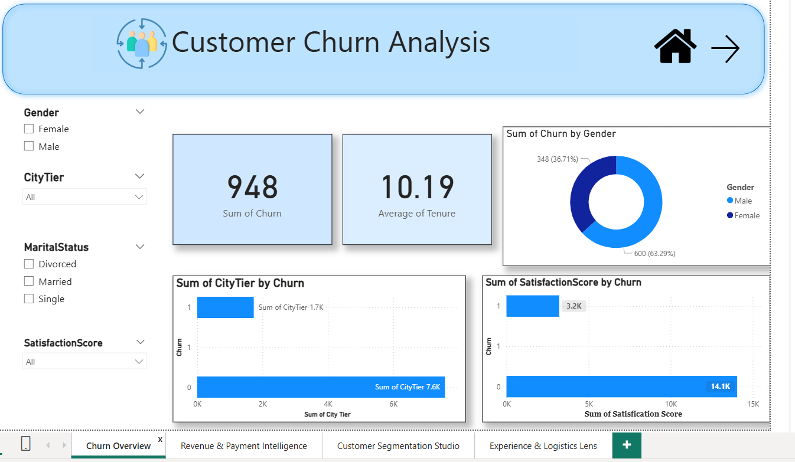

# Customer Churn Analysis Case Study (Power BI)

This project explores customer churn patterns in an e-commerce platform using Power BI dashboards and data analytics techniques.

## Problem Statement

The company faced increasing customer churn despite offering cashback incentives and promotions. The goal of this project was to identify behavioral and operational factors influencing customer retention and revenue.

## Tools Used

- Power BI
- Data Analytics
- Data Visualization
- Business Intelligence

## Project Objectives

### 1. Customer Churn Analysis
- Identify patterns among churned vs retained customers.
- Analyze the relationship between complaints, tenure and satisfaction.

### 2. Revenue & Payment Intelligence
- Evaluate revenue trends across payment methods.
- Analyze the impact of cashback incentives on repeat purchases.

### 3. Customer Segmentation
- Segment customers based on order frequency and value.
- Identify high-value customers for targeted marketing.

### 4. Operational Efficiency
- Study delivery distance and its impact on churn.
- Evaluate satisfaction scores and complaint patterns.

## Key Insights

- Customers with frequent complaints and long delivery distances showed higher churn rates.
- Cashback incentives significantly improved repeat purchases.
- Credit and debit card users had higher average order values.
- Tier-1 city customers contributed the most revenue but were more sensitive to service issues.

## Business Outcome

The analysis helped simulate business improvements such as:

- Reducing churn through personalized offers
- Improving delivery efficiency
- Targeting high-value customers
- Supporting data-driven decision making

## Dashboard Preview

## Author

Anjum Khan  
